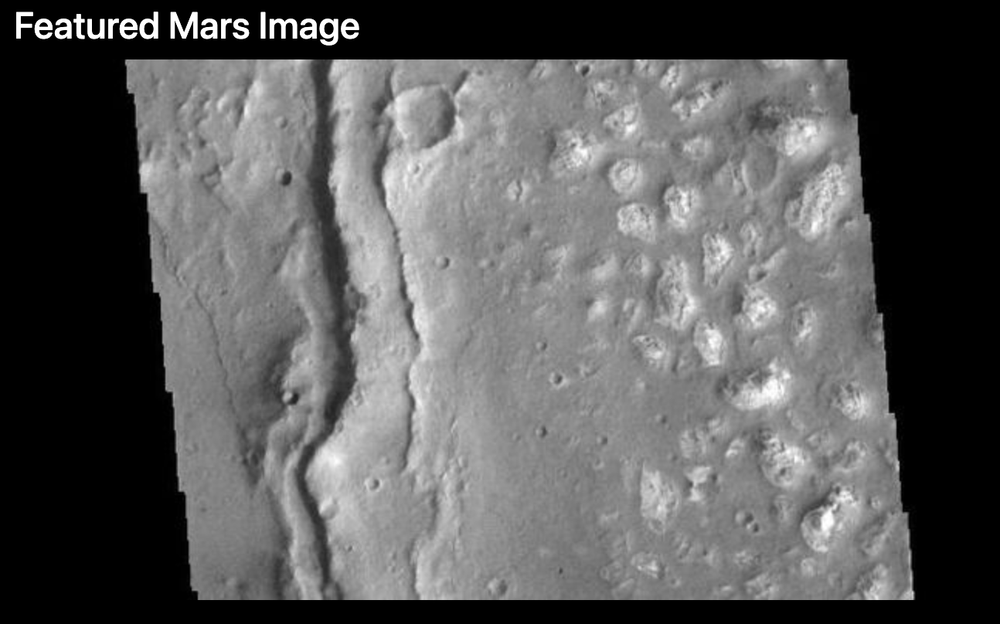

# Mission-to-Mars

## Summary

We automated a web browser to visit different websites to extract data about the Mission to Mars. We stored it in a NoSQL database, and then rendered the data in a web application created with Flask. The completed work will be displayed in our portfolio.

Web scraping is a method used by organizations worldwide to extract online data for analysis. Large companies employ web scraping to assess their reputations or track their competitors' online presence.

On a smaller scale, web scraping automates tedious tasks for personal projects. For example, if you're collecting current news on a specific subject, web scraping can make it a simple process. Instead of visiting each website and copying an article, a web scraping script will perform those actions and save the scraped data for later analysis.

We adjusted the current web app to include all four of Mars' hemisphere images. To do this, we used BeautifulSoup and Splinter to scrape full-resolution images of Mars’s hemispheres and the titles of those images, stored the scraped data on a Mongo database, used a web application to display the data, and altered the design of the web app to accommodate these images:

Featured Mars Image

Mars' Hemispheres

